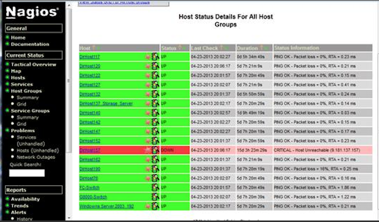

# Prometheus简介

Prometheus受启发于Google的Borgmon监控系统（相似的Kubernetes是从Google的Brog系统演变而来），从2012年开始由前Google工程师在Soundcloud以开源软件的形式进行研发，并且于2015年早期对外发布早期版本。2016年5月继Kubernetes之后成为第二个正式加入CNCF基金会的项目，同年6月正式发布1.0版本。2017年底发布了基于全新存储层的2.0版本，能更好地与容器平台、云平台配合。


Prometheus作为新一代的云原生监控系统，目前已经有超过650+位贡献者参与到Prometheus的研发工作上，并且超过120+项的第三方集成。

## 监控的目标

在《SRE: Google运维解密》一书中指出，监控系统需要能够有效的支持白盒监控和黑盒监控。通过白盒能够了解其内部的实际运行状态，通过对监控指标的观察能够预判可能出现的问题，从而对潜在的不确定因素进行优化。而黑盒监控，常见的如HTTP探针，TCP探针等，可以在系统或者服务在发生故障时能够快速通知相关的人员进行处理。通过建立完善的监控体系，从而达到以下目的：

* 长期趋势分析：通过对监控样本数据的持续收集和统计，对监控指标进行长期趋势分析。例如，通过对磁盘空间增长率的判断，我们可以提前预测在未来什么时间节点上需要对资源进行扩容。
* 对照分析：两个版本的系统运行资源使用情况的差异如何？在不同容量情况下系统的并发和负载变化如何？通过监控能够方便的对系统进行跟踪和比较。
* 告警：当系统出现或者即将出现故障时，监控系统需要迅速反应并通知管理员，从而能够对问题进行快速的处理或者提前预防问题的发生，避免出现对业务的影响。
* 故障分析与定位：当问题发生后，需要对问题进行调查和处理。通过对不同监控以及历史数据的分析，能够找到并解决根源问题。
* 数据可视化：通过可视化仪表盘能够直接获取系统的运行状态、资源使用情况、以及服务运行状态等直观的信息。

## 与常见监控系统比较

对于常用的监控系统，如Nagios、Zabbix的用户而言，往往并不能很好的解决上述问题。这里以Nagios为例，如下图所示是Nagios监控系统的基本架构：


Nagios的主要功能是监控服务和主机。Nagios软件需要安装在一台独立的服务器上运行，该服务器称为监控中心。每一台被监控的硬件主机或者服务都需要运行一个与监控中心服务器进行通信的Nagios软件后台程序，可以理解为Agent或者插件。



首先对于Nagios而言，大部分的监控能力都是围绕系统的一些边缘性的问题，主要针对系统服务和资源的状态以及应用程序的可用性。 例如：Nagios通过check_disk插件可以用于检查磁盘空间，check_load用于检查CPU负载等。这些插件会返回4种Nagios可识别的状态，0(OK)表示正常，1(WARNING)表示警告，2(CRITTCAL)表示错误，3(UNKNOWN)表示未知错误，并通过Web UI显示出来。

对于Nagios这类系统而言，其核心是采用了测试和告警(check&alert)的监控系统模型。 对于基于这类模型的监控系统而言往往存在以下问题：

* 与业务脱离的监控：监控系统获取到的监控指标与业务本身也是一种分离的关系。好比客户可能关注的是服务的可用性、服务的SLA等级，而监控系统却只能根据系统负载去产生告警；
* 运维管理难度大：Nagios这一类监控系统本身运维管理难度就比较大，需要有专业的人员进行安装，配置和管理，而且过程并不简单；
* 可扩展性低： 监控系统自身难以扩展，以适应监控规模的变化；
* 问题定位难度大：当问题产生之后（比如主机负载异常增加）对于用户而言，他们看到的依然是一个黑盒，他们无法了解主机上服务真正的运行情况，因此当故障发生后，这些告警信息并不能有效的支持用户对于故障根源问题的分析和定位。

# Prometheus的优势

Prometheus是一个开源的完整监控解决方案，其对传统监控系统的测试和告警模型进行了彻底的颠覆，形成了基于中央化的规则计算、统一分析和告警的新模型。 相比于传统监控系统Prometheus具有以下优点：

##  易于管理

Prometheus核心部分只有一个单独的二进制文件，不存在任何的第三方依赖(数据库，缓存等等)。唯一需要的就是本地磁盘，因此不会有潜在级联故障的风险。

Prometheus基于Pull模型的架构方式，可以在任何地方（本地电脑，开发环境，测试环境）搭建我们的监控系统。对于一些复杂的情况，还可以使用Prometheus服务发现(Service Discovery)的能力动态管理监控目标。

## 监控服务的内部运行状态

Prometheus鼓励用户监控服务的内部状态，基于Prometheus丰富的Client库，用户可以轻松的在应用程序中添加对Prometheus的支持，从而让用户可以获取服务和应用内部真正的运行状态。


## 强大的数据模型

所有采集的监控数据均以指标(metric)的形式保存在内置的时间序列数据库当中(TSDB)。所有的样本除了基本的指标名称以外，还包含一组用于描述该样本特征的标签。

如下所示：

```
http_request_status{code='200',content_path='/api/path', environment='produment'} => [value1@timestamp1,value2@timestamp2...]

http_request_status{code='200',content_path='/api/path2', environment='produment'} => [value1@timestamp1,value2@timestamp2...]
```

每一条时间序列由指标名称(Metrics Name)以及一组标签(Labels)唯一标识。每条时间序列按照时间的先后顺序存储一系列的样本值。

表示维度的标签可能来源于你的监控对象的状态，比如code=404或者content_path=/api/path。也可能来源于的你的环境定义，比如environment=produment。基于这些Labels我们可以方便地对监控数据进行聚合，过滤，裁剪。

## 强大的查询语言PromQL

Prometheus内置了一个强大的数据查询语言PromQL。 通过PromQL可以实现对监控数据的查询、聚合。同时PromQL也被应用于数据可视化(如Grafana)以及告警当中。

通过PromQL可以轻松回答类似于以下问题：

* 在过去一段时间中95%应用延迟时间的分布范围？
* 预测在4小时后，磁盘空间占用大致会是什么情况？
* CPU占用率前5位的服务有哪些？(过滤)

## 高效

对于监控系统而言，大量的监控任务必然导致有大量的数据产生。而Prometheus可以高效地处理这些数据，对于单一Prometheus Server实例而言它可以处理：

* 数以百万的监控指标
* 每秒处理数十万的数据点。

## 可扩展

Prometheus是如此简单，因此你可以在每个数据中心、每个团队运行独立的Prometheus Sevrer。Prometheus对于联邦集群的支持，可以让多个Prometheus实例产生一个逻辑集群，当单实例Prometheus Server处理的任务量过大时，通过使用功能分区(sharding)+联邦集群(federation)可以对其进行扩展。

## 易于集成

使用Prometheus可以快速搭建监控服务，并且可以非常方便地在应用程序中进行集成。目前支持： Java， JMX， Python， Go，Ruby， .Net， Node.js等等语言的客户端SDK，基于这些SDK可以快速让应用程序纳入到Prometheus的监控当中，或者开发自己的监控数据收集程序。同时这些客户端收集的监控数据，不仅仅支持Prometheus，还能支持Graphite这些其他的监控工具。

同时Prometheus还支持与其他的监控系统进行集成：Graphite， Statsd， Collected， Scollector， muini， Nagios等。

Prometheus社区还提供了大量第三方实现的监控数据采集支持：JMX， CloudWatch， EC2， MySQL， PostgresSQL， Haskell， Bash， SNMP， Consul， Haproxy， Mesos， Bind， CouchDB， Django， Memcached， RabbitMQ， Redis， RethinkDB， Rsyslog等等。

## 可视化

Prometheus Server中自带了一个Prometheus UI，通过这个UI可以方便地直接对数据进行查询，并且支持直接以图形化的形式展示数据。同时Prometheus还提供了一个独立的基于Ruby On Rails的Dashboard解决方案Promdash。最新的Grafana可视化工具也已经提供了完整的Prometheus支持，基于Grafana可以创建更加精美的监控图标。基于Prometheus提供的API还可以实现自己的监控可视化UI。

## 开放性

通常来说当我们需要监控一个应用程序时，一般需要该应用程序提供对相应监控系统协议的支持。因此应用程序会与所选择的监控系统进行绑定。为了减少这种绑定所带来的限制。对于决策者而言要么你就直接在应用中集成该监控系统的支持，要么就在外部创建单独的服务来适配不同的监控系统。

而对于Prometheus来说，使用Prometheus的client library的输出格式不止支持Prometheus的格式化数据，也可以输出支持其它监控系统的格式化数据，比如Graphite。

因此你甚至可以在不使用Prometheus的情况下，采用Prometheus的client library来让你的应用程序支持监控数据采集。

接下来，在本书当中，将带领读者感受Prometheus是如何对监控系统的重新定义。
